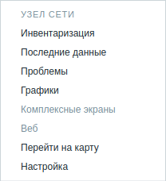

# Zabbix-menupopup-gotomap

---
Добавляет дополнительный пункт "**Перейти на карту**" во всплывающем меню 
Zabbix, который перенаправляет на карту сети, 
где находится выбранное оборудование



Версия Zabbix 5.x
## Установка

---
Создаем бэкап оригинального файла `menupopup.js`

    sudo cp /usr/share/zabbix/js/menupopup.js /usr/share/zabbix/js/menupopup.js.back

Указываем необходимый IP адрес Zabbix сервера в начале файла `menupopup.js`, 
расположенный в папке проекта
```javascript
var zabbix_server_ip = '127.0.0.1'
```
Указываем в файле `zabbixapi.conf` Необходимые данные для ZabbixAPI
```
ZabbixURL=http://127.0.0.1/zabbix
ZabbixLogin=login
ZabbixPassword=password
```
В файле `blacklist` можно указать названия карт сети, которые необходимо проигнорировать
```
Map_name1
Map_name2
```
Запускаем файл `maps.get.py`, предварительно указав его, как исполняемый

Данный скрипт обращается ко всем картам сети Zabbix из чего создается 
соответствие между картой и всеми узлами сети, 
которые на ней нанесены. 

Данные записываются в файл `get_map_id.php`, который необходимо скопировать
в директорию `/usr/share/zabbix/`

Далее перезапускаем apache или nginx

    systemctl restart apache2
    systemctl restart nginx
